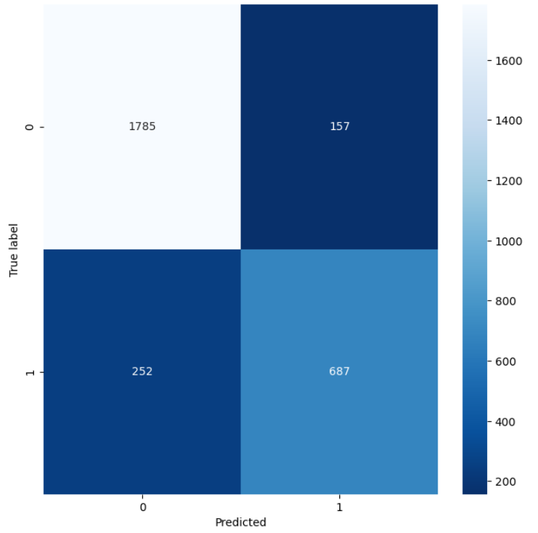

# Пример решения задачи определения токсичных комментариев с использование машинного обучения

Описание работы:
----

Ввиду широкого развития и распространения средств коммуникации остро начал стоять вапрос использования нормативной лексики в 
общении между людьми. Данная проблема особенно обострена у различного рода торговых платформ , платформ по предоставлению 
различного рода услуг и средств поддержки. Зачастую пользователи допускают использование ненормативной лексики в  комментариях,
отзывах и т д... 

И как следствие пред  владельцами площадок появляется задача фильтрации ненормативной лексики. 
Конечно если отзывов не много это можно сделать и в ручную. Но если имеется большое число отзывов просмотр их всех
вручную становится невозможным. 

Целью нашей работы является создание алгоритма определения типа комментария. Является ли комментарий оставленный 
пользователем не нормативным то есть токсичными или нейтральным. 
 

Описание данных:
----
Данные представленны в labeled.csv файле состоят из более чем 14 тысяч строк.
Столбец comment: Содержит  текст комментария
Столбец toxic: Содержит информацию
где 0 - комментарий нейтрален; 1 - комментарий токсичен. 

Данные представленные в with_lemma.csv файле имеют одинаковую структуру с labeled.csv с одной лишь разницей что в них
 дополнительно представлен леметезированый текст (Лемматиза́ция — процесс приведения словоформы к лемме — её нормальной 
 (словарной) форме) Столбеца comment. (Лемматиза́цию мы сделали сам. )

План работа:
----
По сути перед нами стоит задача бинарной классификации. Одним из подходящих алгоритмов для решения задач 
бинарной классификации является logistic Regression .

1. Загрузим данные из labeled.csv 
2. Сделаем предобработку и анализ данных
    2.1 Сделаем лемматизацию текста
3. Разделим данные на бучающию и тестовую выборку
4. Подготовим Pipeline добавим в pipe векторизацию данных и модель логистической регресии с регулеризацией. 
5. Подберем гиперпараметры  (силу регулеризаций)
6. Оценим качество модели

Результаты 
----
Accuracy: 0.8580354043734815

Precision: 0.8139810426540285

Recall: 0.731629392971246

F1 score: 0.770611329220415

Матрица ошибок
----

Вывод:
----
Вывод

1 Количество Мажорного класа 0 (Не токсичный) превышает количество минорного класса 1 (Токсичного).

2 Значения в столбце toxic перевели из float в int

3 Для подготовки текста была проведена лемматизация текста и очистка текста от знаков припенания

4 В виду наличия комментариев не на русском зыке а так же состоящих из чисел и рандомных букв. При лемматизация текста получились пропуски в количестве 8 штук

5 В лемматезированном тексте было выявлено наличие 268 дубликатов.

6 Пропуски и дубликаты были удалены

7 Проделано преобразование TF-IDF

8 Разделили данные 80 на 20 для обучение модели

8.1 В виду наличие большой разности между количеством классов. Будем использовать логистическую регресию с параметром class_weight='balanced'

8.2 Для обучени я модели с использованием GridSearchCV проводился подбор гипер параметров

8.3 Лучшая модель LogisticRegression(C=4, class_weight='balanced', max_iter=5000, penalty='l1', solver='saga'))

8.4 Результаты

Accuracy: 0.8580354043734815

Precision: 0.8139810426540285

Recall: 0.731629392971246

F1 score: 0.770611329220415

Для улучшение качества обнаружения можно посоветовать опробовать другие виды алгоритмов. Например RandomForest или же Или же изменить порог классификации для ошибок первого, второго рода.

Исходный код представлен в:
---
filter_toxic.ipynb
